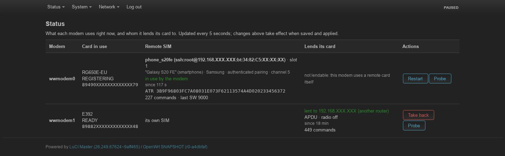
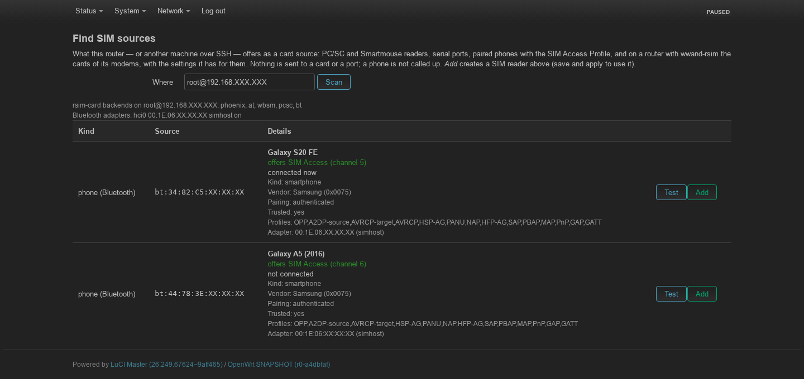
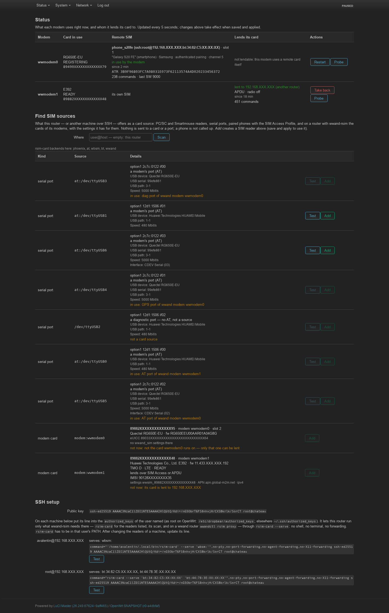
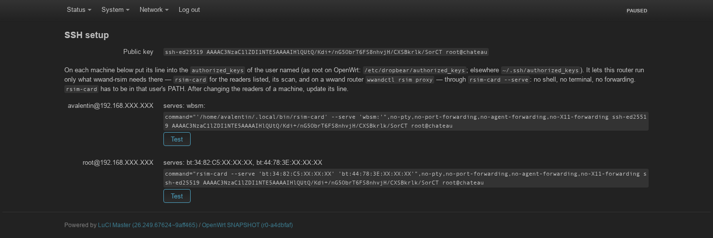
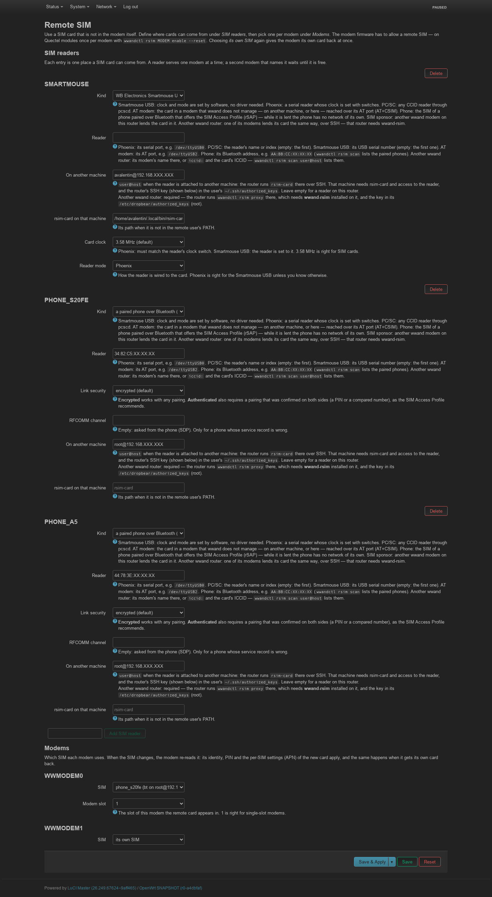

# wwand-rsim

A SIM card in a reader on the router, used by the modem as if it sat in the
modem's own slot. A plugin for [wwand](https://github.com/ddimension/wwand):
the modem side is Qualcomm's QMI UIM Remote service, the card side a reader
on the router or on another machine over SSH (Phoenix serial, Smartmouse
USB, PC/SC), a phone's SIM over Bluetooth SAP, a modem wwand does not manage
over `AT+CSIM`, another wwand modem on the router (a SIM sponsor), or a
modem on another wwand router.

Status: in use on hardware — see [What works](#what-works) for the modems,
readers, phones and sponsors it has run with, and the workarounds for them.
Design notes: [docs/plan.md](docs/plan.md).

> **Modem support: HW-verified clients are Quectel.** The modem that runs
> on the remote card has to offer Qualcomm's QMI UIM Remote. wwand-rsim's
> client side is vendor-neutral QMI; only switching the service ON is
> vendor-specific — an EFS item that wwand-rsim can write on Quectel alone
> (`wwandctl rsim MODEM enable --reset`, `AT+QNVFW`). HW-verified clients:
> Quectel RG650E-EU (QMI) and RM520N-GL (MBIM, through the QMI
> passthrough). On another vendor's Qualcomm modem UIM Remote has to be on
> in its firmware already (wwand-rsim cannot switch it) — untested, **tbd**;
> so are Telit/u-blox SAP client modes and Osmocom SIMtrace2 card
> emulation: [docs/modems.md](docs/modems.md). The card *source* is not
> limited this way: a reader, a phone, or a Huawei, MeiG or other modem that
> answers `AT+CSIM` can lend its card.

## Parts

- `helper/` — `rsim-card`, the C helper that owns the reader (or is the
  osmo-remsim client of a SIM bank, `rspro:`) and speaks one JSON object per
  line on stdin/stdout.
- `plugins/rsim.uc` — the wwand plugin: runs the helper, offers the card to the
  modem, serves its commands.
- `ctl/rsim.uc` — `wwandctl rsim`: status, the modem firmware switches
  (UIM Remote, SIM Access), probe and donor test.
- `ctl/rsim_provider.uc` — `wwandctl rsim proxy`, package
  **wwand-rsim-provider** (depends on wwand-rsim): this router's modem cards
  lent to another router over SSH. Without it a router lends its cards only
  to its own modems (a SIM sponsor); a scan from another router says the
  package is missing there and offers nothing of its modems but an AT port.
- `luci/` — `luci-app-wwand-rsim`: the configuration page.

## Use

Step-by-step setups with diagrams — a reader on the router, a reader on
another machine over SSH, a phone over Bluetooth, an external AT modem, a
SIM sponsor on the same router, a modem on another wwand router, and how to
scan for sources: **[docs/howto.md](docs/howto.md)**. Which modems can be
clients: [docs/modems.md](docs/modems.md).

```sh
wwandctl rsim switch                 # is UIM Remote on in the modem firmware?
wwandctl rsim enable --reset         # switch it on (Quectel), reset the modem
uci set network.wwmodem0.rsim_reader='phoenix:/dev/ttyUSB0'
uci commit network; ubus call wwand reload
wwandctl rsim                        # reader, card, state
```

With a named reader (`config wwand_simreader`, e.g. from LuCI):

```sh
wwandctl rsim wwmodem0 use smartmouse --wait 120 --json   # run on its card
wwandctl rsim wwmodem0 use off --wait 60 --json           # own SIM again
```

`use` sets `option rsim` and reloads (the modem is not restarted). With
`--wait` it returns once the modem RUNS on the card — the remote card
powered and a new identity read (whether it registers depends on the
network; `modem_state` in the result says), or its own card read again
(registered or still searching) — and exits 0. It looks every 2 s; when
nothing changes (the reader is already the one in use, or the modem already
on its own card) no new identity is waited for, the first look that finds
the card in use ends it. A failure of this attempt that is not retried on
its own (no card, reader missing) ends the wait at the next look with exit
1; so does another modem holding the reader, once the plugin has had a tick
to note it (after about 12 s). `off` also removes a spelled-out `rsim_reader`. `--json` prints the result as one JSON line
(`ok`, `state`, `iccid`, `error`), for scripts such as a lab test driver.

Options on the `wwand_modem` section: `rsim_reader` (`phoenix:<tty>` or
`pcsc:<reader name or index>`), `rsim_slot` (1), `rsim_fallback`
(`off|local`, what it runs on while the remote SIM is not connected — see
below), and for Phoenix readers `rsim_clock` (kHz, 3579), `rsim_reset`
(`auto|rts|rts_inv|dtr|dtr_inv`), `rsim_detect` (`none|cts|dsr|cd`).

Readers: `phoenix:<tty>` (a Phoenix/Smartmouse serial reader with switches),
`wbsm:[USB serial]` (WB Electronics Smartmouse USB: clock and mode set by
software, `rsim_clock` 3580/3680/6000, `rsim_mode` phoenix/smartmouse),
`pcsc:<name or index>`, `at:<tty>` — the SIM of a modem that wwand does not
manage (on a SIM host, or on this router), reached over its AT port with
AT+CSIM (TS 27.007 §8.17). That modem keeps the card; it deregisters first
(`AT+COPS=2`, a detach while it still has the card), then its radio is
switched off (`AT+CFUN=4`, the SIM stays reachable) while the card is used
elsewhere, and both — radio mode, then network selection — are put back as
they were afterwards, also when the helper is stopped or its SSH
link drops. One helper per AT port (a lock; a second one waits up to 20 s,
long enough for the previous one to finish restoring the radio). A modem
that rebooted while its card is lent is switched off again on the target's
next power-up or reset. Killed hard (SIGKILL, power loss), it cannot: the mode it had is
kept in `/tmp/rsim-card-cfun-<port>`, and the next run restores that one at
its end (`rsim_at_radio keep` leaves the radio alone, `rsim_at_baud` for a
real UART). The ATR is the minimal T=0 ATR `3B00`: plain AT has no command for the
card's own. As a named reader: `option type 'at'`, `option device
'/dev/ttyUSB2'`, optionally `host`, `radio`, `baud`.

**A phone's SIM:** `bt:<address>` — a phone paired with this machine
over Bluetooth, whose SIM is lent over the SIM Access Profile (SAP, often
called rSAP in cars). The phone hands its card over and has no network of
its own while it is lent; it gets it back when the helper ends. Also on a
SIM host (`ssh:<user>@<host>:bt:AA:BB:CC:DD:EE:FF`), e.g. a PC next to the
phone. As a named reader: `option type 'bt'`, `option device '<address>'`,
optionally `host`, `security` (`high`: a pairing confirmed on both sides),
`channel` (instead of SDP), `apdu` (`7816`: CommandAPDU7816). Plain modem
options: `rsim_bt_channel`, `rsim_bt_security`, `rsim_bt_apdu`.

What the phone needs: the SIM Access Profile *server*. Stock Android has it,
but most vendors build it switched off (`profile_supported_sap`); Samsung
and some other phones sold for cars ship it on. With it, the phone asks once
whether this device may use its SIM (allow it permanently — the first
connection gives up after 60 s). What this machine needs: a kernel with
Bluetooth and RFCOMM, BlueZ (`bluetoothd`) running with the phone paired
and trusted (`bluetoothctl pair|trust <address>`) — rsim-card itself uses
only kernel sockets, no BlueZ library. On OpenWrt `/var/lib/bluetooth` is in
RAM: a pairing is gone after a reboot unless that directory is kept.
A dropped link (phone out of range, SIM access switched off on the phone)
ends the helper; the modem gets its own SIM back and the plugin tries again.

**A modem's card on another wwand router:** `ssh:<user>@<host>:wwand:<modem>`,
or `ssh:<user>@<host>:wwand:iccid:<ICCID>` to name the card rather than the
modem it sits in (a `wwand:` reader exists only over SSH; on this router
the same card is `modem:<name>`).
There the plugin runs `wwandctl rsim proxy <modem|iccid:ICCID>` instead of
rsim-card: a relay that speaks rsim-card's protocol on stdin/stdout and
hands each request to the rsim plugin in THAT router's daemon, which lends
the card the way a SIM sponsor on one router does — by default (`auto`)
over the SIM Access Profile, or APDU by APDU over `AT+CSIM` where the lending
modem has no QMI UIM (an NCM modem); forced APDU by APDU with
`rsim_donor_mode apdu` (with
`rsim_donor_slot`, `rsim_donor_apdu`, `rsim_donor_cond` as for a sponsor).
Its radio is parked for as long as the card is lent, its interfaces are
refused (`radio_held`), and its status page says to whom. The card goes
home when the proxy ends: at the end of stdin (a dropped SSH link
included), or — killed hard — when the daemon there sees its process gone
(within 10 s). A modem there that is configured for a remote card itself
(connected to it or not), lends its card
to a modem there, or is configured as a sponsor there is not lent. This
needs **wwand-rsim-provider** on that router (the proxy; it pulls in
wwand-rsim) — without it, `wwandctl rsim scan` from here says so and lists
none of its modems' cards, only their AT ports; a router with only
rsim-card has no modems to lend. As a named reader: `option type
'wwand'`, `option host`, `option device '<modem>|iccid:<ICCID>'`, and the
`donor_*` options.

**A card in an osmo-remsim SIM bank:** `rspro:<server>[:<port>]` or
`rspro:<server>[:<port>]/<bank>:<slot>`. rsim-card is then a remsim
*client*: it talks RSPRO (osmo-remsim's Remote SIM Protocol — ASN.1/BER in
IPA frames over TCP) to the remsim-server (port 9998) and to the
remsim-bankd the server points it to, which owns the card. With a bank slot
in the spec, the helper maps that slot to this client over the server's
REST API (port 9997) while it runs, and removes the mapping at the end; a
slot mapped to another client is refused, one already mapped to our client
(a run that was killed) is taken as ours and removed at the end too. Without one, it uses whatever the server's operator mapped
to its client — a mapping that appears later is reported as a card
inserted, one taken away as removed. The client is `rsim_rspro_client
'<id>[:<slot>]'` (default `0:0`; two modems using the bank at the same
time need two — with the same client, two readers of one bank left at the
default say, they are one client to the server, so only the first is
started and the other's status says why; LuCI's *Add* from a bank scan
gives each slot a free client), the REST port `rsim_rspro_rest_port`. As a named reader:
`option type 'rspro'`, `option device '<server>[:<port>]'`, `option bank
'<bank>:<slot>'`, `option client`, `option rest_port`. It is reached
directly, never over SSH. `rsim-card` has its own small BER codec — no
asn1c, no libosmocore; `-DWITH_RSPRO=OFF` builds it without.
**Not tested against a real osmo-remsim** (none at hand, 2026-09-27): the
messages follow `asn1/RSPRO.asn`, the REST calls remsim-server's
`rest_api.c`, and the tests run against a simulated server and bankd.

`rsim-card --list` on a router with wwand-rsim adds its modems' cards
(`wwandctl rsim proxy --list`): each with its ICCID, IMSI, modem and slot,
whether it can be lent now (only the card a modem runs on; why not
otherwise), and the `wwand_sim` settings that router has for it — APN, PDP
type, login; the PIN and password only as "set", never their values. So
`wwandctl rsim scan user@host` shows them from the other side; here they
appear as `modem:<name>` (a sponsor on this router).

**What is there to use:** `wwandctl rsim scan` lists what this router
offers as a card source — PC/SC readers (with or without a card), Smartmouse
USB readers, serial ports that look like a Phoenix adapter or a modem's AT
port, paired phones (whether each offers SIM Access, as BlueZ last read it
— the phone is not called up, that would take its SIM; BlueZ's storage is
readable by root only) — each with the spec to put into a reader; the ports of wwand's own
modems are marked (an `at:` reader there would take the card from under
wwand; that is the `modem` kind). `wwandctl rsim scan user@simhost` asks a
SIM host over SSH the same. Underneath: `rsim-card --list`, JSON lines,
which only looks: nothing is sent to a port. The slots of a SIM bank come
from its server instead: `wwandctl rsim scan --rspro <server>[:port]
[--rest-port N]` (`rsim-card --list --rspro-server …`) — RSPRO itself has no
message to list banks or slots (a client only learns the slot mapped to it),
so this asks the remsim-server's REST API: each bank slot with its spec,
and to which client it is mapped, if any.

**SSH, restricted to what wwand-rsim needs:** `wwandctl rsim ssh-key
[user@host]` creates the router's key and prints, per machine the
configuration reaches over SSH, the line for its `authorized_keys`:

```
command="rsim-card --serve 'bt:AA:BB:CC:DD:EE:FF' 'wwand:iccid:8949…'",no-pty,no-port-forwarding,no-agent-forwarding,no-X11-forwarding ssh-ed25519 AAAA… wwand-rsim
```

`rsim-card --serve` runs only wwand-rsim's own calls — rsim-card for the
readers listed (fnmatch patterns, where `*` does not cross a `/`:
`at:/dev/ttyUSB*`; none: any), its `--list` (with readers listed: their rows
only — not the other cards of that machine, their ICCIDs and settings), and
on a wwand router `wwandctl rsim proxy` for `wwand:<modem>` /
`wwand:iccid:<ICCID>` targets listed — split into words and exec'd, never
through a shell. Only rsim-card's own options pass. An `rspro:` reader is
never served (it would make that machine connect to any host it is told);
a SIM bank is reached from the router directly. A reader that names a
path (`at:`, `phoenix:`) has to be, under `--serve`, a path under `/dev`
that resolves to `/dev/tty*`, `/dev/rfcomm*` or `/dev/pts/*` and is a
character device; rsim-card itself, `--serve` or not, opens only a serial
port (a character device that is a tty): named a file, it would read it out
and write AT commands over it. It is
part of rsim-card, so it works on a PC with nothing but rsim-card as well as
on a wwand router. `wwandctl rsim scan user@host` says what is wrong when a
machine does not answer: no key yet, key not accepted (and the line to put
there), a restricted key that does not allow the call, rsim-card missing,
a changed host key, not reachable.

**A reader on another machine:** `rsim_reader 'ssh:<user>@<host>:<reader>'`
runs the helper there over SSH, e.g. `ssh:rsim@pc.lan:wbsm:`. On the router,
`wwandctl rsim ssh-key` creates its key and prints the public half for the
other machine's `~/.ssh/authorized_keys`; that machine needs `rsim-card` in
its PATH (or `rsim_ssh_helper`) and access to the reader. Optional:
`rsim_ssh_port`, `rsim_ssh_key`. A dropped connection is handled like a
helper that exited: the modem gets its own SIM back and the plugin retries.

**Another modem's card:** `rsim_reader 'modem:<donor>'` lets another wwand
modem on the router lend its SIM — over the SIM Access Profile
(`rsim_donor_mode sap`, the donor hands its card over; a Quectel needs the
EFS item that wwand-rsim writes on its own — see *Workarounds*; by hand
`wwandctl rsim DONOR sap-enable`), or APDU by APDU while the card stays with
the donor (`rsim_donor_mode apdu`, over QMI UIM or `AT+CSIM`,
`rsim_donor_apdu auto|qmi|at`). Unset (the default, *automatic* in LuCI):
SIM Access where the donor has it, APDU where it has not — a donor without
QMI UIM (an NCM modem) lends over `AT+CSIM`, and one whose SIM Access is
known to hang (Huawei E392), or has not answered a connect once, lends
APDU by APDU. A modem configured as another's donor keeps
its radio off, link or not — wwand refuses its interfaces (`radio_held`) and
parks any registration of it — and gets it back when that configuration is
removed, as its own `option lowpower` allows. `rsim_donor_slot` names the donor's physical slot (default: the
one it runs on) — only that one can be lent: on a single-standby modem the
other slot is switched off and cannot be reached, so one modem cannot use one
card and lend the other (HW-checked on a Quectel RG502Q and RG650E,
2026-09-26). `wwandctl rsim MODEM probe` tells whether a modem offers UIM Remote
(the service a remote card needs) and SIM Access, and `donor-test` whether it
can lend its card.

**LuCI:** `luci-app-wwand-rsim` — Network → Remote SIM sets all of this per
modem, and more:
- **Status**, every 5 s: per modem the card in use, the remote SIM (reader,
  state, since when, ATR, commands and last SW, the last error and when it is
  retried), and whom it lends its own card to (a modem here or another
  router, how, since when, commands) — or why it cannot lend it. Buttons:
  *Restart*, *Take back* (ends lending to another router and stops it until
  *Allow lending*), *Probe* (what its UIM offers for lending).
- **Find SIM sources**: the scan of this router or of `user@host` — readers,
  serial ports, paired phones, and the cards of a wwand router's modems with
  the settings it has for them — each with *Add*, which creates the SIM
  reader for it (a card of a modem here as a SIM sponsor).
- **SSH setup**: the router's key (*Create key* when there is none), and per
  machine the restricted `authorized_keys` line with a *Test* that shows what
  is wrong and what to do.

`wwandctl rsim MODEM take-back` / `lend-allow` do the same as the buttons;
`wwandctl rsim` shows the lending too.

The page on a MikroTik Chateau 5G, captured with wwand's
`tools/luci-screenshot.py` (ICCID, IMSI, IMEI, EID and addresses masked).
**Status**: the RG650E runs on the SIM of a Galaxy S20 FE, lent over
Bluetooth SAP by a PC next to the phone; the Huawei E392 lends its own card
APDU by APDU to another wwand router, its radio off:



**Find SIM sources** on that PC (`root@…`, a restricted key): two paired
phones that offer SIM Access, with what BlueZ knows about each — *Add*
turns one into a SIM reader:



The same scan of this router: its modems' ports (those wwand drives, and a
diagnostic port, are not offered) and the cards of its modems — one lent
already, the other not the card its modem runs on:



...and of another wwand router, whose modem's card comes with the settings
that router dials it with:


**SSH setup**: the router's key and, per machine, the `authorized_keys`
line restricted to `rsim-card --serve` and the readers named there:



**SIM readers** and **Modems**: a Smartmouse USB on one machine, the two
phones behind another, and which of them each modem uses:



wwand's modem status page shows the remote SIM in the modem panel:


Removing `rsim_reader` gives the modem its own SIM back.

**The lender's settings come along:** a card borrowed from another wwand
router brings the settings its owner dials it with — that router's
`wwand_sim` for the ICCID, or else the APN, PDP type and login of the
modem's interface. (A sponsor on this router needs none of that: a
`wwand_sim` for its card applies to both modems as it is.) They are kept here as the card's own
`wwand_sim` (`wwsim_<ICCID>`, `option origin 'rsim'`), so the next dial with
that card uses them, now and after a restart. A `wwand_sim` you wrote for
the card is never touched; removing the `origin` line makes one of these
yours.

**A sponsor deregisters before its card goes:** its radio is parked
*before* the card leaves it — before the SIM Access connect, before the
first APDU, before an AT port's first command — so the modem detaches from
the network while it still has the card, instead of dropping off it with
the card; the target then attaches with that IMSI on a network that has
let go of it. The park is the modem's own radio switch in wwand — QMI
low power, `AT+CFUN=4` on NCM/AT. An **MBIM** modem has one only with a
wwand whose MBIM backend switches the radio (radio state off); with an
older one the park is refused there, and an MBIM sponsor lends over SIM
Access without the detach (a warning in the log) and not at all APDU by
APDU. The same holds for parking an MBIM *client* before its remote card
goes (below).

**While a card is lent, its modem's radio is off, the SIM left on** — on
every path: QMI `LOW_POWER`, MBIM radio state off (with a wwand that has
it, see above), `AT+CFUN=4` on an NCM
modem and on an AT port (rsim-card; deregistered with `AT+COPS=2` first,
read back, parked again if something switches it on, radio and network
selection put back as they were at the end). `CFUN=0` is used only on an
NCM modem that refuses 4 (wwand's `modem_ncm`); an `at:` port whose modem
refuses `CFUN=4`, or does not read back 4, is not lent at all (unless
`rsim_at_radio keep`). Two modems must never register with one card.

**A modem with a remote SIM does not run on its local card:** from the
daemon's first moment until the modem has taken the remote card, its radio
is held off — wwand refuses its interfaces (`radio_held`) and parks any
registration of it — and it goes online once the modem has connected to
the remote card. The same when the remote SIM fails, its reader is
misconfigured, the modem lets go of it, or the modem is connected but the
card cannot be powered (no ATR): the modem stays off rather than falling
back to the card in its own slot. (A card the modem powers down and up
again itself is not a reason: that is normal use.) The status page says
why. The hold from the daemon's very first moment needs wwand with the
init hold (commit `106132a`, *radio hold at init*); an older wwand brings
the modem up on its own card first and parks it once the plugin runs.

Whenever the remote card goes away while the modem runs on it — the reader
fails, another reader is configured, `wwandctl rsim restart`, the daemon
stops — its radio is switched off **before** the modem is told, so it
leaves the network with that card instead of dropping off it. At the
daemon's exit it stays off until the next start. Removing the remote SIM
from the configuration is the exception: the modem is meant to have its own
card back then.

**`option rsim_fallback`** on the `wwand_modem` section decides what the
modem runs on while its remote SIM is not connected:

| Value | While the remote SIM is not connected |
|---|---|
| `off` (default) | nothing — the radio is held off as above |
| `local` | the modem's own SIM; it switches to the remote card once that connects, and when that goes its radio is parked first, then it comes back on its own card |

`local` is for a remote SIM reached **over this modem's own connection** —
a SIM bank (`rspro:`), a reader or another router over SSH (`ssh:`,
`wwand:`) — on a router with no other way out: with the radio held off the
modem could never reach its remote SIM, and the router would be cut off
for good. Any other value is taken as `off` and warned about in the log.
`wwandctl rsim` and the status page show the mode in effect. LuCI: *Modems
→ When the remote SIM is not connected*.

## What works

HW-tested on OpenWrt routers — MikroTik Chateau 5G (RG650E-EU, 245),
Zyxel NR7101 (RG502Q, 242), Cudy LT300 v3 (MeiG SLM770A-R, 3.113), GL.iNet
GL-X3000 (RM520N-GL, 3.93) — and a Linux PC as SIM host, 2026-09-26/27. *Works* means the modem read the card,
authenticated with it and registered; *card only* that the card was read
and used but the network refused the subscription (an inactive SIM).

**Clients — a modem that runs on a remote card** (QMI UIM Remote; Qualcomm
modems, the service switched on in the firmware — Quectel: `wwandctl rsim
enable --reset`):

| Modem | Card from | Result |
|---|---|---|
| Quectel RG650E-EU (QMI) | NR7101's RG502Q over SSH, SIM Access | works, data |
| | Cudy's MeiG SLM770A over SSH, APDU over `AT+CSIM` | works, data (IPv4) |
| | Huawei E392 on the same router, APDU over QMI UIM | works (registered; no data with that SIM's plan) |
| | Galaxy S20 FE over Bluetooth SAP, via a PC | card only (inactive SIM) |
| | Galaxy A5 (2016) over Bluetooth SAP, via a PC | card only (inactive SIM) |
| Quectel RM520N-GL (MBIM, GL-X3000) | Smartmouse USB on a PC over SSH, through the QMI-over-MBIM passthrough | card only (a test card without service there; 431 commands, identity read) |
| | the Chateau's Huawei E392 over SSH, APDU over QMI UIM | works (registered, connected with the card's own APN; no data with that SIM's plan) |

An MBIM modem is a client through its QMI-over-MBIM passthrough (wwand's
`qmi_client` there): on the RM520N the UIM Remote indications come over it,
although NAS's do not. Not a client: NCM modems (no QMI at all), and MBIM
modems without the passthrough; other Qualcomm modems are untested.

**Providers — where a card can come from:**

| Kind | Tested with | State |
|---|---|---|
| `wbsm:` WB Electronics Smartmouse USB | on a PC (Vodafone card) | card only (that SIM is inactive) |
| `phoenix:` Phoenix serial reader | simulated card only | not HW-tested |
| `pcsc:` PC/SC reader | simulated card only | not HW-tested |
| `bt:` phone, SIM Access Profile | Galaxy S20 FE, Galaxy A5 (2016) | card only (inactive SIMs; root, the init network namespace) |
| `at:` a modem wwand does not manage | Huawei E392 PC UI port, Samsung S20 USB modem | both refuse `AT+CSIM` (CME 4 / Samsung's AT lock) — refused at open, with the reason |
| `modem:` sponsor on this router | Huawei E392 (QMI) | works, APDU (automatic) |
| `wwand:` modem on another wwand router | Quectel RG502Q (SIM Access), MeiG SLM770A-R on NCM (APDU over `AT+CSIM`) | works |
| `rspro:` osmo-remsim SIM bank | simulated remsim-server and bankd only | not tested against osmo-remsim |

**Workarounds** — each found on the hardware above, each covered by a test:

- *Phones (SAP):* the connect asks for 1024-byte messages and steps down
  (512, 300, 276, 261) when refused — Samsung's SAP takes only 261 at first.
  A `CONNECT_RESP` arriving late is ignored; an ATR response without an ATR
  is asked again (a phone whose SIM is not ready); the phone's
  `DISCONNECT_RESP` often comes late and is waited for 2 s, not required.
  Bluetooth sockets exist only in the init network namespace: on a PC in a
  container, run rsim-card through `nsenter -t 1 -n`.
- *Quectel as sponsor (SIM Access):* SAP needs the EFS item
  `…/uim/sap_security_restrictions` = 00. Once wwand-rsim is installed it
  writes that in the AT init of EVERY Quectel modem on QMI or MBIM, sponsor
  or not (read first, written only when it differs, then one modem reset) —
  except where the modem's UIM is known to lack SIM Access; per modem off
  with `option rsim_sap_auto '0'` on its `wwand_modem`. The connect's condition
  TLV is refused as malformed by some firmware (`rsim_donor_cond none`); a
  sponsor busy with a data session (QMI 52) has its radio parked and is
  asked once more.
- *Huawei E392 as sponsor:* its SIM Access takes the card and never answers
  the connect (the modem then needs a reset) — so APDU by default. Its QMI
  UIM does not pass SEARCH RECORD or file access by short file identifier
  (QMI error 3); the card's answer `6A81` (function not supported) goes back
  instead of an I/O error, and the client falls back to SELECT + READ.
- *APDU sponsors:* a UIM that refuses `SEND_APDU` (QMI 71/82/94) is used
  over `AT+CSIM`; one without QMI UIM (NCM) over `AT+CSIM` from the start.
  The ATR is the minimal `3B00` there — AT has no command for the card's.
- *Sponsor start:* a lending waits until the sponsor's services are up; a
  daemon restart no longer makes the first attempt fail for good.
- *Card change on the client:* the identity is read from the card, never
  from the firmware's cache (`GET_IMSI` answers the previous card's IMSI for
  a while — which matched the previous card's `wwand_sim`, PIN and APN).
- *AT ports (`at:`):* nothing is sent at scan time. At open: a diagnostic
  port (by the interface's name or Huawei's protocol byte) is refused
  unopened, `AT+CSIM` is probed once and a modem that refuses it is refused
  with the reason (Samsung's `PACM` lock named as such), the modem
  deregisters (`COPS=2`) and the radio is parked with `CFUN=4` and read back
  — not parked, not lent (its network selection then put back).
- *Slow links:* a command through a remote AT sponsor takes about 1 s (the
  Cudy: SSH, a small CPU, `AT+CSIM`); a client reads ~150–250 commands
  before it registers, so the first registration takes 2–3 minutes. The
  first answer of a Bluetooth or proxy source may take 60 s.

## A SIM host: only the reader tool

On another OpenWrt router that just holds the reader, install the package
**`rsim-card`** from the feed — it is the helper alone (`/usr/bin/rsim-card`,
plus `libusb-1.0` for the Smartmouse USB), without wwand or anything else of
this project:

```sh
apk add rsim-card                     # opkg install rsim-card on older releases
rsim-card wbsm:                       # try it: {"op":"power_up"} on stdin
```

The same package carries the osmo-remsim client (`rspro:`), but that one
runs on the router with the modem, which reaches the SIM bank itself — never
on a SIM host over SSH (`rsim-card --serve` refuses it).

Then on the router with the modem: `option rsim_reader
ssh:<user>@<simhost>:wbsm:` (or a `wwand_simreader` with `host`), and the
router's key (`wwandctl rsim ssh-key`) in the SIM host's
`/etc/dropbear/authorized_keys` (root) or `~/.ssh/authorized_keys`. The
`wwand-rsim` package on the modem's router pulls `rsim-card` in as well, for
readers plugged into that router itself.

## Building the helper

`rsim-card` is the only part a **SIM host** needs: with
`option rsim_reader ssh:<user>@<host>:<reader>` the plugin runs it on that
machine **by name**, so it has to be in its `PATH` (`/usr/local/bin/rsim-card`
is enough). Nothing in it is architecture-specific — the toolchain decides —
and the backends are optional, so it builds anywhere CMake does:

```sh
cmake -S helper -B build && cmake --build build          # dynamic, backends AUTO

# static, for a host with nothing installed
cmake -S helper -B build-static -DRSIM_STATIC=ON -DWITH_LIBUSB=OFF -DWITH_PCSC=OFF
cmake --build build-static

# cross build: the usual toolchain file, same switches
cmake -S helper -B build-arm -DRSIM_STATIC=ON \
      -DCMAKE_TOOLCHAIN_FILE=/path/to/arm.cmake
cmake --build build-arm
```

`WITH_BLUETOOTH` (default ON) builds the `bt:` backend. It needs no
library, only the kernel's sockets, and costs about 12 KB (aarch64, -Os);
`-DWITH_BLUETOOTH=OFF` leaves it out of a minimal build.

`WITH_RSPRO` (default ON) builds the `rspro:` backend, the osmo-remsim
client. No library either (its own BER codec and HTTP/1.0 for the REST
calls); `-DWITH_RSPRO=OFF` leaves it out.

`RSIM_STATIC=ON` links with `-static` and takes the **static** link lines from
pkg-config, so an enabled backend brings its own dependencies along. That is
also its limit: `libusb-1.0` on a glibc distribution pulls `libudev`, which is
rarely installed as an archive — the link then stops with *"have you installed
the static version of the udev library?"*. Either install it, or leave the
Smartmouse USB out (`-DWITH_LIBUSB=OFF`, Phoenix readers still work). On
OpenWrt/musl libusb needs no udev, so a fully static build with the USB
backend works there.

## Tests

```sh
tests/run_tests.sh                   # plugin + ctl, against ../wwand
(cd helper && cmake -S . -B build && cmake --build build && cd build && ctest)
```

## License

GPL-2.0-only.
