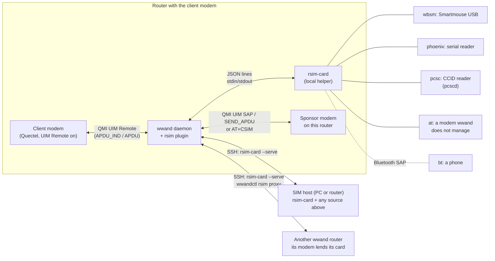
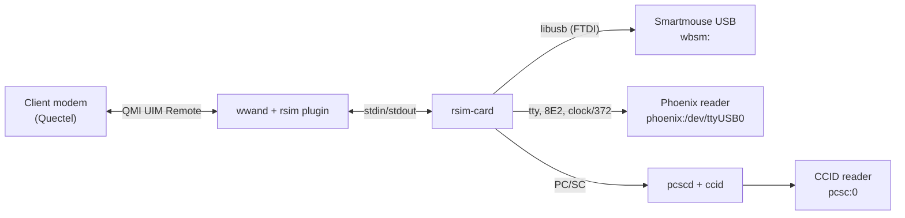
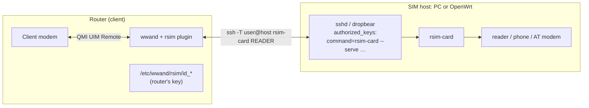
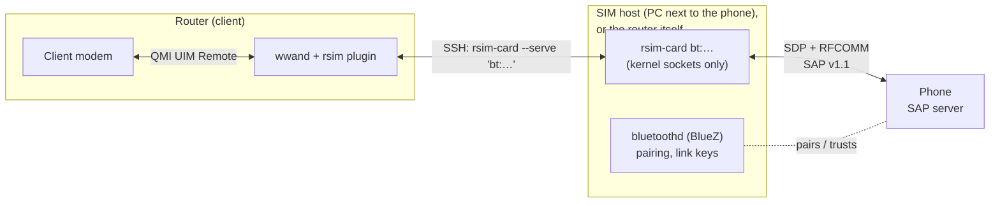
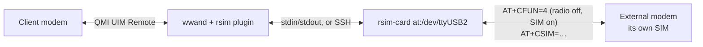
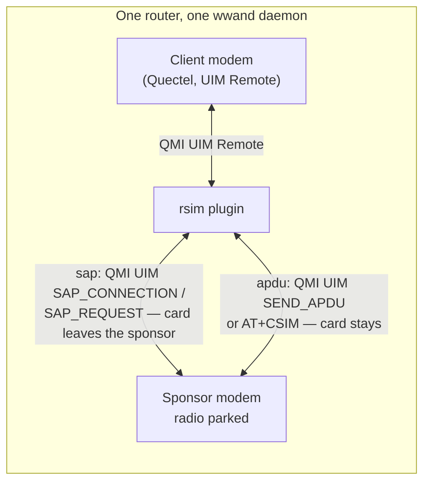
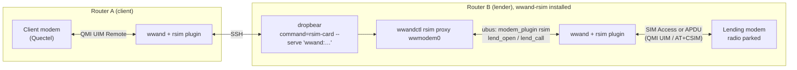

# wwand-rsim how-tos

One section per way of lending a SIM card to a modem, each with what it is
for, the pieces involved, the configuration, how to check it, and its limits.
The reference for every option is the [README](../README.md); which modems can
run on a remote card at all is in [modems.md](modems.md).

> **The client — the modem that runs on the remote card — has to be a
> Quectel modem** with Qualcomm's QMI UIM Remote service switched on
> (`wwandctl rsim MODEM enable --reset`). The card *sources* below are not
> limited that way: a phone, a reader, a Huawei or MeiG modem can all lend a
> card. See [modems.md](modems.md).

Contents:

- [The pieces](#the-pieces)
- [First: switch UIM Remote on in the client modem](#first-switch-uim-remote-on-in-the-client-modem)
- [Finding a source: scan and test](#finding-a-source-scan-and-test)
- [1. A reader on the router itself](#1-a-reader-on-the-router-itself) — Smartmouse USB, Phoenix serial, PC/SC
- [2. A reader on another machine, over SSH](#2-a-reader-on-another-machine-over-ssh)
- [3. A phone's SIM over Bluetooth SAP](#3-a-phones-sim-over-bluetooth-sap)
- [4. The card of an external AT modem (`at:`)](#4-the-card-of-an-external-at-modem-at)
- [5. A SIM sponsor: another modem on the same router](#5-a-sim-sponsor-another-modem-on-the-same-router)
- [6. A modem on another wwand router (`wwand:`)](#6-a-modem-on-another-wwand-router-wwand)
- [Checking any setup](#checking-any-setup)

## The pieces

Every setup has the same shape: the client modem asks for APDUs over QMI UIM
Remote, the wwand-rsim plugin inside the wwand daemon answers them, and the
answers come from a card source — `rsim-card` (a local helper process, or one
started over SSH on another machine), the daemon itself (a sponsor modem on
this router), or `wwandctl rsim proxy` on another wwand router.



Configuration lives in `/etc/config/network`, as everything of wwand does.
There are two ways to say which card a modem uses:

- a **named reader** — `config wwand_simreader '<name>'` with `option type`
  (`wbsm`, `phoenix`, `pcsc`, `at`, `bt`, `modem`, `wwand`) and the options
  of that type — and on the modem `option rsim '<name>'`. This is what LuCI
  (Network → Remote SIM) writes, and what `wwandctl rsim MODEM use <name>`
  switches between.
- **spelled out** on the modem: `option rsim_reader '<spec>'` plus the
  `rsim_*` options. Handy on the command line.

The examples below use named readers; each section also gives the spec.
After a change: `uci commit network; ubus call wwand reload` — or
`wwandctl rsim MODEM use <name> --wait 120`, which sets `option rsim`,
reloads and waits until the modem runs on the card. Neither restarts the
modem.

## First: switch UIM Remote on in the client modem

UIM Remote is compiled into Qualcomm firmware but registered only when the EFS
item `/nv/item_files/modem/uim/remote/uim_remote_service_enable` says so, and
it is read at modem boot. It read `00` (off) on every Quectel modem tested
(RG650E, RG502Q, RM520N-GL; HW-observed 2026-09-26). Once per client modem:

```sh
wwandctl rsim wwmodem0 switch           # UIM Remote  off (/nv/.../uim_remote_service_enable = 00)
wwandctl rsim wwmodem0 enable --reset   # AT+QNVFW writes 01, reads it back, resets the modem
wwandctl rsim wwmodem0 probe            # UIM Remote  offered by the modem (a remote card can be used)
```

`enable` reads and writes the item with Quectel's `AT+QNVFR`/`AT+QNVFW` and
refuses on a modem that does not answer them ("this needs a Quectel modem
with AT+QNVFR"). `disable --reset` switches it off again. The plugin never
writes this item on its own. If you skip this step, the status says: *the
modem does not offer UIM Remote — switch it on with `wwandctl rsim enable`
and reset the modem*.

## Finding a source: scan and test

```sh
wwandctl rsim scan                    # what this router offers
wwandctl rsim scan rsim@pc.lan        # what a SIM host offers, over SSH
wwandctl rsim scan root@router2 --json
wwandctl rsim test wbsm:              # open ONE source, power its card up, hand it back
wwandctl rsim test bt:AA:BB:CC:DD:EE:FF rsim@pc.lan
wwandctl rsim test /dev/ttyUSB3       # a bare port: the scan says what it is
```

The scan runs `rsim-card --list` (here, or on the SIM host exactly as a
session would run it) and prints one row per source with the spec to use:
PC/SC readers (with or without a card), Smartmouse USB readers, serial ports
that look like a Phoenix adapter or a modem's AT port, paired phones (with
whether they offer SIM Access, as BlueZ last read it), and on a wwand router
the cards of its modems with the `wwand_sim` settings that router has for
them (the PIN and password only as "set"). It only looks: nothing is sent to
a port, no phone is called. Ports of wwand's own modems are marked
`IN USE`. A SIM host that does not answer gets a diagnosis (no key yet, key
not accepted, a restricted key that does not allow the call, rsim-card
missing, a changed host key, not reachable).

`test` is the step that talks to a source: it powers the card up once
(`works — ATR 3B…`) or says why not (an AT port that refuses `AT+CSIM`, a
phone that refuses SIM access). An `at:` source keeps its radio as it is
during a test. Ports of wwand's own modems are refused (use `modem:<name>`).

In LuCI, **Network → Remote SIM → Find SIM sources** is the same scan, with
*Test* and *Add* (which creates the SIM reader) per row.

## 1. A reader on the router itself

**For:** a SIM card in a USB reader plugged into the router — the simplest
setup, no network in between.



### WB Electronics Smartmouse USB (`wbsm:`)

rsim-card drives the reader's FTDI chip over libusb and sets its clock and
wiring by software — no `ftdi_sio`, no tty, no switches. The `rsim-card`
package brings `libusb-1.0`.

```
config wwand_simreader 'smartmouse'
	option type 'wbsm'
	# option device '<USB serial>'   only with more than one reader
	# option clock '3680'            3580 (default), 3680 or 6000 kHz
	# option mode 'smartmouse'       phoenix (default) | smartmouse wiring

config wwand_modem 'wwmodem0'
	...
	option rsim 'smartmouse'
```

Spelled out: `option rsim_reader 'wbsm:'` (`rsim_clock`, `rsim_mode`).

### Phoenix / Smartmouse serial reader (`phoenix:`)

A reader behind a USB-serial bridge (or a real UART) with its clock and
wiring set by switches. rsim-card sets the baud rate to clock/372 exactly and
pulses reset on RTS (or DTR).

```
config wwand_simreader 'phoenix'
	option type 'phoenix'
	option device '/dev/ttyUSB0'
	# option clock '3579'      kHz, as the reader's switch says (default 3579)
	# option reset 'auto'      auto | rts | rts_inv | dtr | dtr_inv
	# option detect 'none'     none | cts | dsr | cd: a card-detect line
```

Spelled out: `option rsim_reader 'phoenix:/dev/ttyUSB0'` (`rsim_clock`,
`rsim_reset`, `rsim_detect`). `auto` tries RTS, then inverted RTS, and keeps
what answered.

### A PC/SC (CCID) reader (`pcsc:`)

Any CCID token reader, through `pcscd`. Install **`rsim-card-pcsc`**
instead of `rsim-card` (it provides the same name and pulls in pcscd and the
CCID driver); pcscd has to be running. `rsim-card --list` shows the readers
pcscd knows.

```
config wwand_simreader 'ccid'
	option type 'pcsc'
	option device '0'          # the reader's index, or a substring of its name
```

Spelled out: `option rsim_reader 'pcsc:0'` or `'pcsc:Omnikey'`.

### Check

```sh
wwandctl rsim wwmodem0
logread -e rsim
```

Expected log lines (notice level), in this order:

```
rsim wwmodem0: remote card offered to the modem (slot 1, reader wbsm:, ATR 3B…)
rsim wwmodem0: the modem connected to the remote card (slot 1)
rsim wwmodem0: card powered up, ATR 3B…
```

`wwandctl rsim wwmodem0` then shows `remote SIM … in use by the modem`, the
reader, the ATR and a growing command count with the last status word; the
modem reads the card's ICCID/IMSI and registers as with its own SIM.

### Limits

- HW-tested: `wbsm:` (on a PC, as SIM host). `phoenix:` and `pcsc:` are
  tested against a simulated card only (README, *What works*).
- T=0 only, at F=372 D=1: no PPS, no character repetition. A card in
  specific mode at another rate will not work.
- `phoenix:` has no VCC control: power-down holds the card in reset.
- Without a card-detect line (`detect`) a pulled card shows only as a failing
  command; PC/SC and `detect` report removal and insertion.

## 2. A reader on another machine, over SSH

**For:** the card is somewhere else — a PC next to the phone or the reader,
a second OpenWrt box — and the router reaches it over the network. Nothing
new is spoken: the plugin runs `rsim-card` there over SSH, and the same JSON
lines travel through the encrypted link.



### On the SIM host

- **OpenWrt:** `apk add rsim-card` (or `rsim-card-pcsc`; `opkg install` on
  older releases) — the helper alone, without wwand.
- **A Linux PC:** build it from `helper/` (README, *Building the helper*;
  `-DRSIM_STATIC=ON` for a binary with nothing to install) and put it in
  that user's `PATH`, e.g. `/usr/local/bin/rsim-card` — or name its path on
  the router (`option helper` / `rsim_ssh_helper`). The user needs access to
  the reader (root, or for `wbsm:` a udev rule for USB 104f:0002).

### On the router: the key and the restricted line

```sh
wwandctl rsim ssh-key                 # creates /etc/wwand/rsim/id_dropbear (or id_ed25519)
wwandctl rsim ssh-key rsim@pc.lan     # just the line for that machine
```

It prints the public key and, per machine the configuration reaches over
SSH, the `authorized_keys` line restricted to that machine's readers:

```
command="rsim-card --serve 'wbsm:'",no-pty,no-port-forwarding,no-agent-forwarding,no-X11-forwarding ssh-ed25519 AAAA… wwand-rsim
```

Put it into `~rsim/.ssh/authorized_keys` on the SIM host (for root on
OpenWrt: `/etc/dropbear/authorized_keys`). `rsim-card --serve` reads the
requested command from `SSH_ORIGINAL_COMMAND` and runs only wwand-rsim's own
calls: `rsim-card [its options] <reader>` for a reader one of the listed
patterns matches (fnmatch, `*` does not cross a `/`: `'at:/dev/ttyUSB*'`;
none listed: any), `rsim-card --list` (cut down to those readers), and on a
wwand router `wwandctl rsim proxy` for listed `wwand:` targets. It is split
into words and exec'd, never passed to a shell. Configure the readers first
and run `ssh-key` afterwards, so the line lists them.

### The reader

```
config wwand_simreader 'pc_smartmouse'
	option type 'wbsm'
	option host 'rsim@pc.lan'
	# option port '2222'                      SSH port
	# option key '/etc/wwand/rsim/other_key'  another key
	# option helper '/opt/rsim/rsim-card'     rsim-card outside the PATH there
```

Any local type works with `host`: `wbsm`, `phoenix`, `pcsc`, `at`, `bt`.
Spelled out: `option rsim_reader 'ssh:rsim@pc.lan:wbsm:'` (`rsim_ssh_port`,
`rsim_ssh_key`, `rsim_ssh_helper`). The host key is accepted on first use
and checked after that; keepalives end a session on a dead link.

LuCI: **Network → Remote SIM → SSH setup** shows the router's key
(*Create key* when there is none) and per machine the line with a *Test*.

### Check

```sh
wwandctl rsim scan rsim@pc.lan        # answers → key accepted, rsim-card found
wwandctl rsim test wbsm: rsim@pc.lan  # works — ATR 3B…
wwandctl rsim wwmodem0                # reader … on pc.lan …, in use by the modem
```

The log is that of section 1, with `reader ssh:rsim@pc.lan:wbsm:`.

### Limits

- A dropped SSH link is handled like a helper that exited: the modem gets
  its own SIM back and the plugin retries with backoff.
- Latency: each command crosses the link once. Over a LAN that is
  milliseconds; through a slow AT sponsor (the Cudy LT300: SSH, a small CPU,
  `AT+CSIM`) about 1 s per command, and a client reads ~150–250 commands
  before it registers — 2–3 minutes to the first registration.
- A changed host key (a reinstalled SIM host) stops the session: remove the
  old entry from `/root/.ssh/known_hosts`; the scan says so.

## 3. A phone's SIM over Bluetooth SAP

**For:** the SIM stays in a phone; the phone lends it over the Bluetooth SIM
Access Profile (SAP, "rSAP" in cars). While it is lent the phone has no
network of its own; it gets its SIM back when the helper ends.



### Prerequisites

- **The phone** needs the SIM Access Profile *server*. Stock Android has it,
  but most vendors build it switched off (`profile_supported_sap`); Samsung
  and some phones sold for cars ship it on (HW-tested: Galaxy S20 FE, Galaxy
  A5 (2016)). On the first connection the phone asks whether this device may
  use its SIM — allow it permanently; that first connection gives up after
  60 s.
- **The machine running rsim-card:** a kernel with Bluetooth and RFCOMM,
  BlueZ's `bluetoothd` running, the phone paired and trusted:

  ```sh
  bluetoothctl pair AA:BB:CC:DD:EE:FF
  bluetoothctl trust AA:BB:CC:DD:EE:FF
  ```

  rsim-card does no pairing and uses no BlueZ library, only kernel sockets.
  It must run as root in the **init network namespace** (Bluetooth sockets
  exist only there): on a PC inside a container, run it through
  `nsenter -t 1 -n`.
- On OpenWrt `/var/lib/bluetooth` is in RAM: a pairing is gone after a
  reboot unless that directory is kept.

### Configuration

On a SIM host (a PC next to the phone — the tested setup):

```
config wwand_simreader 'phone'
	option type 'bt'
	option device 'AA:BB:CC:DD:EE:FF'
	option host 'root@pc.lan'
	# option security 'high'   a pairing confirmed on both sides (default: medium, encrypted)
	# option channel '8'       the phone's SAP RFCOMM channel instead of SDP
	# option apdu '7816'       CommandAPDU7816 instead of CommandAPDU
```

And on the SIM host, the restricted line from `wwandctl rsim ssh-key
root@pc.lan`, e.g. for two phones:

```
command="rsim-card --serve 'bt:AA:BB:CC:DD:EE:FF' 'bt:11:22:33:44:55:66'",no-pty,no-port-forwarding,no-agent-forwarding,no-X11-forwarding ssh-ed25519 AAAA… wwand-rsim
```

Without `host` the phone is paired with the router itself. Spelled out:
`option rsim_reader 'ssh:root@pc.lan:bt:AA:BB:CC:DD:EE:FF'`
(`rsim_bt_channel`, `rsim_bt_security`, `rsim_bt_apdu`).

### Check

```sh
wwandctl rsim scan root@pc.lan
# ssh:root@pc.lan:bt:AA:BB:CC:DD:EE:FF  phone "Galaxy S20 FE" over Bluetooth, offers SIM Access
wwandctl rsim test bt:AA:BB:CC:DD:EE:FF root@pc.lan   # the phone lends its SIM for a moment
wwandctl rsim wwmodem0
```

`SIM Access unknown (services not read yet)` in the scan means BlueZ never
read the phone's services; `NOT offered` means it is off or missing on the
phone. The first answer of a Bluetooth source may take 60 s.

### Limits

- A dropped link (phone out of range, SIM access switched off on the phone)
  ends the helper; the modem gets its own SIM back and the plugin tries
  again.
- Phones answer with small SAP messages (Samsung's first accepts 261 bytes);
  rsim-card steps the size down on its own.
- Tested with rsim-card on a Linux PC; not on an OpenWrt router as the
  Bluetooth end.

## 4. The card of an external AT modem (`at:`)

**For:** a modem that wwand does **not** manage — on a SIM host, or plugged
into this router but not configured in wwand — lends its card APDU by APDU
over `AT+CSIM` (TS 27.007 §8.17). The card stays in that modem.



```
config wwand_simreader 'usbstick'
	option type 'at'
	option device '/dev/ttyUSB2'      # its AT port
	# option host 'root@simhost'      on another machine
	# option radio 'keep'             leave its radio alone (default: CFUN=4 while lent)
	# option baud '115200'            a real UART; USB ports ignore it
```

Spelled out: `option rsim_reader 'at:/dev/ttyUSB2'` (`rsim_at_radio`,
`rsim_at_baud`). The device has to be a character device under `/dev`;
rsim-card refuses anything else.

What happens: at open, a diagnostic port is refused unopened, `AT+CSIM` is
probed once (a modem that refuses it is refused with the reason), the radio
is parked with `AT+CFUN=4` and read back. It is put back as it was at the
end — also when the helper is stopped or its SSH link drops, and a modem that
rebooted meanwhile is parked again. One helper per AT port (a lock); a
second one waits up to 20 s.

### Check

```sh
wwandctl rsim test /dev/ttyUSB2        # works — ATR 3B00
wwandctl rsim wwmodem0
```

### Limits

- The ATR is always the minimal T=0 ATR `3B00`: plain AT has no command for
  the card's own.
- Many modems refuse `AT+CSIM`: the Huawei E392 PC UI port (CME 4) and a
  Samsung S20 as USB modem (its AT lock) both did (HW-tested) — refused at
  open, with the reason.
- Killed hard (SIGKILL, power loss) the helper cannot restore the radio; the
  mode it had is kept in `/tmp/rsim-card-cfun-<port>` and the next run
  restores it at its end.
- A port of one of wwand's own modems is not a source here — that is a SIM
  sponsor (section 5).

## 5. A SIM sponsor: another modem on the same router

**For:** a second modem on the router (a Huawei stick, a spare Quectel)
holds the card; the client modem runs on it. No helper process: the daemon
talks to both modems itself.



```
config wwand_simreader 'sponsor'
	option type 'modem'
	option donor 'wwmodem1'           # the wwand_modem that lends its card
	# option donor_mode 'apdu'        sap | apdu (unset: automatic)
	# option donor_apdu 'at'          auto | qmi | at (apdu mode)
	# option donor_slot '1'           the sponsor's PHYSICAL slot (default: the one it runs on)
	# option donor_cond 'none'        leave out the SAP connect's condition TLV

config wwand_modem 'wwmodem0'
	...
	option rsim 'sponsor'
```

Spelled out: `option rsim_reader 'modem:wwmodem1'` (`rsim_donor_mode`,
`rsim_donor_apdu`, `rsim_donor_slot`, `rsim_donor_cond`).

**SAP vs APDU:**

- `sap` — the sponsor's UIM acts as SIM Access Profile server and hands the
  card over while the link stands.
- `apdu` — the card stays with the sponsor; each command goes over QMI UIM
  `SEND_APDU` or `AT+CSIM`. The ATR is the card's (QMI `GET_ATR`) or `3B00`
  over plain AT.
- unset (*automatic* in LuCI) — SIM Access where the sponsor has it, APDU
  where it has not: a sponsor without QMI UIM (an NCM modem) lends over
  `AT+CSIM`; one whose SIM Access is known to hang (Huawei E392), or has not
  answered a connect once, lends APDU by APDU. A UIM that refuses
  `SEND_APDU` is used over `AT+CSIM`.

**Quectel as SAP sponsor:** the UIM refuses SIM Access (`ACCESS_DENIED`)
until the EFS item `/nv/item_files/modem/qmi/uim/sap_security_restrictions`
is `00` (HW-observed on the RG650E, 2026-09-26). wwand-rsim writes it in the
modem's AT init when it differs — Quectel only, one modem reset — unless the
sponsor's `wwand_modem` has `option rsim_sap_auto '0'`. By hand:

```sh
wwandctl rsim wwmodem1 sap-switch          # read it
wwandctl rsim wwmodem1 sap-enable --reset  # write 00, read back, reset
```

Some firmware refuses the connect's condition TLV as malformed:
`option donor_cond 'none'`.

**The radio:** a modem configured as a sponsor keeps its radio off, link or
not — it detaches *before* the card leaves it, wwand refuses its interfaces
(`radio_held`), and it gets the radio back when that configuration is
removed, as its own `option lowpower` allows. Two modems never register with
one card.

### Check

```sh
wwandctl rsim wwmodem1 probe                # UIM Remote / SIM Access this modem offers
wwandctl rsim wwmodem1 donor-test apdu qmi  # lend once: ATR + SELECT MF, hand back
wwandctl rsim wwmodem1 donor-test sap
wwandctl rsim wwmodem1                      # lends card  to wwmodem0 (APDU, radio off)
logread -e rsim
```

```
rsim: wwmodem1 lends its card (APDU over QMI UIM, slot 1, radio off)
rsim: radio of wwmodem1 parked while its card is used elsewhere
```

### Limits

- Only the slot the sponsor runs on can be lent: on a single-standby modem
  the other slot is switched off. "Use one card, lend the other" does not work
  (HW-checked on a Quectel RG502Q and RG650E, 2026-09-26).
- Huawei E392: its SIM Access takes the card and never answers (the modem
  then needs a reset) — hence APDU by default; its QMI UIM does not pass
  SEARCH RECORD or short-file-id access, answered `6A81` so the client falls
  back to SELECT + READ.
- After an unclean daemon exit (a crash; `stop` hands the card back first)
  the sponsor may briefly register with its card during the new modem init.

## 6. A modem on another wwand router (`wwand:`)

**For:** the card sits in a modem of another router that runs wwand and
wwand-rsim; that router lends it the way a sponsor does (section 5), and the
router with the client modem borrows it over SSH.



On router A:

```
config wwand_simreader 'router2'
	option type 'wwand'
	option host 'root@router2.lan'
	option device 'wwmodem0'             # its modem there, or 'iccid:8949…' to name the card
	# option donor_mode 'apdu'           sap | apdu (unset: that router decides)
	# option donor_apdu, donor_slot, donor_cond   as for a sponsor
```

Spelled out: `option rsim_reader 'ssh:root@router2.lan:wwand:wwmodem0'` or
`'ssh:root@router2.lan:wwand:iccid:8949…'`. `iccid:` stays right when the card
moves between that router's modems.

On router B: wwand-rsim installed (the proxy is part of it — a box with
only `rsim-card` has no modems to lend), and the line from `wwandctl rsim
ssh-key root@router2.lan` (run on A) in `/etc/dropbear/authorized_keys`:

```
command="rsim-card --serve 'wwand:wwmodem0'",no-pty,no-port-forwarding,no-agent-forwarding,no-X11-forwarding ssh-ed25519 AAAA… wwand-rsim
```

`'wwand:*'` allows every modem there. The proxy runs as
`wwandctl rsim proxy <modem|iccid:ICCID> [--mode sap|apdu|auto] [--slot N]
[--apdu qmi|at] [--cond N]`; `wwandctl rsim proxy --list` shows the cards
that router can lend, with its `wwand_sim` settings for them.

**The lender's settings come along:** the card's APN, PDP type and login
from router B (its `wwand_sim` for the ICCID, or the interface's) are kept on
A as `wwsim_<ICCID>` with `option origin 'rsim'`. A `wwand_sim` you wrote
yourself is never touched.

### Check

On A:

```sh
wwandctl rsim scan root@router2.lan
# ssh:root@router2.lan:wwand:wwmodem0  SIM 8949… in modem wwmodem0 — wwand_sim …, apn …
wwandctl rsim wwmodem0
```

On B:

```sh
wwandctl rsim wwmodem0   # lends card  to <A's address> (another router, …, radio off)
logread -e rsim          # rsim wwmodem0: lending the card to <A's address> (…)
wwandctl rsim wwmodem0 take-back    # end it, and lend no more…
wwandctl rsim wwmodem0 lend-allow   # …until this
```

LuCI on B shows the lending in the status with *Take back* / *Allow lending*.

### Limits

- The card goes home when the proxy ends — at the end of its input (a dropped
  SSH link included) or, killed hard, when B's daemon sees its process gone
  (within 10 s).
- Not lent: a modem on B that runs on a remote card itself, that lends its
  card to a modem on B, or that is configured as a sponsor on B. Only the
  card the modem runs on can be lent.
- HW-tested: Quectel RG502Q (SIM Access) and MeiG SLM770A-R on NCM (APDU over
  `AT+CSIM`) as lenders. Through the MeiG, ~1 s per command: 2–3 minutes to
  the first registration.

## Checking any setup

```sh
wwandctl rsim wwmodem0                  # reader, card, state, lending (the name may be left out on a one-modem router)
wwandctl rsim wwmodem0 restart          # own SIM for a moment, then the remote one again
wwandctl rsim readers                   # the named readers and which modem uses each
wwandctl rsim wwmodem0 use off --wait 60   # back to its own SIM
```

States in `wwandctl rsim`: *waiting to start*, *starting*, *offered to the
modem, waiting for it to connect*, *modem connected, card not powered*, *in
use by the modem*, *stopped* (with the last error and when it is retried).
`use <reader> --wait S --json` prints one JSON line (`ok`, `state`, `iccid`,
`error`) once the modem runs on the card, for scripts.

Removing `option rsim` / `rsim_reader` gives the modem its own SIM back.
